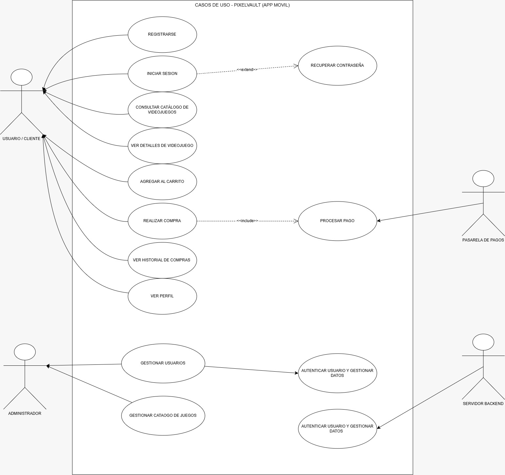

# Diagrama de Casos de Uso - PixelVault Store

## 1. Representación Visual

## 2. Descripción de Actores y Flujos
### Actores

#### Usuario Cliente
Es el usuario principal de PixelVault. Interactúa directamente con la aplicación móvil para administrar su cuenta, consultar videojuegos y realizar compras.

Entre sus principales acciones se encuentran:
- Registrarse.
- Iniciar sesión.
- Consultar el catálogo de videojuegos.
- Filtrar videojuegos por categorías.
- Consultar los detalles de un videojuego.
- Agregar videojuegos al carrito.
- Realizar compras.
- Consultar el historial de compras.
- Editar o consultar su perfil.
- Cerrar sesión.

#### Administrador
Es el actor encargado de las funciones administrativas de la aplicación.

Sus funciones representadas en el sistema incluyen:
- Gestionar usuarios.
- Gestionar productos.
- Consultar información relacionada con las compras.

#### Pasarela de Pagos
En PixelVault representa el proceso relacionado con el pago de una compra. Sin embargo, el proyecto actualmente utiliza un sistema de pago simulado y no una pasarela bancaria real.
El usuario introduce los datos solicitados y la aplicación realiza validaciones antes de completar la compra.

#### AsyncStorage
Representa el almacenamiento local utilizado por PixelVault para conservar información en el dispositivo.

La aplicación utiliza AsyncStorage para guardar:
- La sesión activa.
- Los usuarios registrados.
- Las compras realizadas.

Las principales claves utilizadas son:

- `@pixelvault_sesion`
- `@pixelvault_usuarios`
- `@pixelvault_compras`

---

## 3. Casos de Uso Principales

### Registrarse
Permite al usuario crear una nueva cuenta en PixelVault.

Para realizar el registro se solicitan datos como:
- Nombre.
- Correo electrónico.
- Número de teléfono.
- Contraseña.

La aplicación valida los campos requeridos y comprueba que el correo electrónico no se encuentre registrado anteriormente.
Una vez validada la información, el usuario es agregado a los usuarios registrados y los datos se almacenan mediante AsyncStorage.

### Iniciar Sesión

Permite al usuario acceder a su cuenta utilizando su correo electrónico y contraseña.

La aplicación comprueba que las credenciales coincidan con una cuenta registrada. Si son correctas:
1. Se identifica al usuario.
2. Se guarda el correo de la sesión.
3. Se establece al usuario como conectado.
4. Se recuperan sus datos.
5. Se muestra la pantalla principal.

Si las credenciales son incorrectas, se muestra un mensaje de error.

### Mantener Sesión Activa
Este caso de uso está relacionado con el inicio de sesión.
PixelVault guarda el correo del usuario activo utilizando la clave `@pixelvault_sesion` de AsyncStorage. Cuando la aplicación vuelve a abrirse, comprueba si existe una sesión guardada y puede restaurarla.

### Consultar Catálogo de Videojuegos
Permite al usuario visualizar los videojuegos disponibles en PixelVault.

Los videojuegos se encuentran almacenados en el arreglo `JUEGOS_DATOS` y contienen información como:
- Nombre.
- Categoría.
- Precio.
- Disponibilidad.
- Calificación.
- Descripción.
- Imagen.

Actualmente el catálogo contiene 68 videojuegos distribuidos en diferentes categorías.

### Filtrar por Categorías
Permite organizar el catálogo para mostrar únicamente los videojuegos pertenecientes a una categoría seleccionada.

Las categorías disponibles son:
- Todos.
- Acción.
- Aventura.
- Disparos.
- Estrategia.
- Rol.
- Simulación.
- Deportes y Conducción.

La categoría **Todos** permite volver a visualizar el catálogo completo.

### Ver Detalles del Videojuego
Permite consultar información específica de un videojuego seleccionado.

Entre los datos mostrados se encuentran:
- Imagen.
- Nombre.
- Categoría.
- Calificación.
- Precio.
- Descripción.

La información se muestra mediante un componente Modal dentro de la aplicación.

### Agregar al Carrito
Permite seleccionar videojuegos para posteriormente realizar una compra.
Los productos seleccionados se almacenan temporalmente en el carrito. El usuario puede agregar uno o varios videojuegos antes de continuar con el proceso de compra.

### Realizar Compra
Permite al usuario completar el proceso de compra de los videojuegos agregados al carrito.

El proceso incluye:
1. Revisar los productos seleccionados.
2. Calcular automáticamente el total.
3. Introducir los datos solicitados para el pago.
4. Validar la información.
5. Confirmar la compra.
6. Generar un identificador de transacción.
7. Guardar la compra.

PixelVault utiliza un sistema de pago simulado, por lo que no realiza una transacción bancaria real.

### Procesar Pago
Este caso de uso forma parte del proceso de compra.
La aplicación solicita datos de tarjeta y realiza validaciones antes de permitir completar la operación.

Se comprueba principalmente:
- Que los campos requeridos estén completos.
- Que el número de tarjeta tenga una longitud válida.
- Que el CVV tenga la longitud necesaria.
- Que la fecha de expiración tenga el formato correspondiente.

### Guardar Compra
Cuando una compra es aprobada, PixelVault genera un identificador de transacción de 8 dígitos y registra información como:

- Productos comprados.
- Total.
- Fecha.
- Mes.
- Año.
- Número de transacción.

Las compras se almacenan utilizando la clave `@pixelvault_compras` de AsyncStorage y se relacionan con el usuario que realizó la operación.

### Consultar Historial de Compras
Permite al usuario consultar las compras realizadas anteriormente.
El historial se obtiene desde la información almacenada en el dispositivo y las compras se relacionan con el usuario que realizó cada operación.

### Editar o Consultar Perfil
Permite visualizar los datos asociados a la cuenta que actualmente tiene la sesión iniciada.
La información mostrada corresponde al usuario activo.

### Cerrar Sesión
Permite finalizar la sesión actual.
Al cerrar sesión se elimina la sesión activa almacenada, evitando que la aplicación continúe identificando al usuario como conectado.
Cerrar sesión no elimina la cuenta ni los datos registrados del usuario.

## 4. Resumen del Flujo Principal

El flujo normal de utilización de PixelVault puede resumirse de la siguiente manera:

1. El usuario abre la aplicación.
2. PixelVault comprueba si existe una sesión almacenada.
3. Si no existe una sesión, el usuario inicia sesión.
4. El usuario accede al catálogo de videojuegos.
5. Puede filtrar los videojuegos por categoría.
6. Puede consultar los detalles de un videojuego.
7. Agrega videojuegos al carrito.
8. El carrito calcula automáticamente el total.
9. El usuario inicia el proceso de pago.
10. La aplicación valida los datos introducidos.
11. Se confirma la compra y se genera una transacción.
12. La compra se almacena en el dispositivo.
13. El usuario puede consultar su historial de compras.
14. Finalmente, puede cerrar sesión.

Este flujo utiliza los componentes, estados, funciones y almacenamiento local implementados en PixelVault.