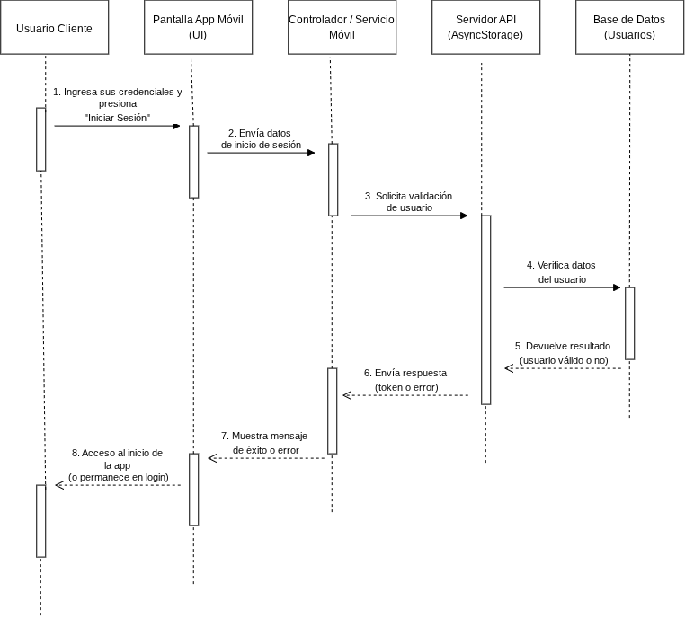

# Diagrama de Secuencia - PixelVault Store

## 1. Diagrama de Interacción

## 2. Explicación del Flujo
El diagrama de secuencia representa el proceso de interacción entre el usuario y los diferentes componentes de la aplicación PixelVault Store durante el flujo de compra de un videojuego.

### Paso 1: Inicio de la aplicación
El usuario abre la aplicación PixelVault Store. El sistema verifica si existe una sesión activa almacenada en el dispositivo.
Si existe una sesión, el usuario puede acceder directamente a la aplicación. Si no existe, debe iniciar sesión o registrarse.

### Paso 2: Inicio de sesión
El usuario introduce su correo electrónico y contraseña.
La aplicación valida los datos ingresados y comprueba que correspondan con un usuario registrado.

Cuando el inicio de sesión es correcto, se almacena la sesión activa utilizando:
`@pixelvault_sesion`

### Paso 3: Consulta del catálogo
Una vez iniciada la sesión, el usuario puede consultar el catálogo de videojuegos.

La aplicación muestra los juegos disponibles y permite filtrarlos mediante diferentes categorías, como:
- Acción
- Aventura
- Disparos
- Estrategia
- Rol
- Simulación
- Deportes y Conducción

### Paso 4: Consulta de detalles
El usuario selecciona un videojuego del catálogo.
La aplicación muestra información relacionada con el juego seleccionado mediante una ventana modal, permitiendo consultar sus detalles antes de realizar la compra.

### Paso 5: Agregar producto al carrito
El usuario selecciona la opción para agregar el videojuego al carrito.
La aplicación actualiza el estado del carrito y agrega el producto seleccionado.
El usuario puede continuar agregando productos o revisar el carrito.

### Paso 6: Cálculo del total
Cuando el usuario revisa el carrito, la aplicación calcula automáticamente el total de los productos seleccionados.
El total se obtiene sumando el precio de cada elemento del carrito.

### Paso 7: Proceso de pago
El usuario selecciona la opción para realizar el pago.
La aplicación muestra el formulario de pago y solicita los datos de una tarjeta.
El sistema realiza validaciones sobre los campos ingresados, incluyendo el número de tarjeta y el código CVV.
Este proceso es una simulación y no utiliza una pasarela bancaria real.

### Paso 8: Confirmación de la compra
Si los datos cumplen con las validaciones requeridas, la compra es aprobada.
La aplicación genera un identificador de transacción de 8 dígitos para distinguir la operación.

También se registra información como:
- Productos comprados.
- Total de la compra.
- Fecha.
- Mes.
- Año.
- Número de transacción.

### Paso 9: Guardado de la compra

La información de la compra se almacena localmente utilizando:
`@pixelvault_compras`

La compra queda asociada al usuario que realizó la operación, permitiendo conservar diferentes historiales para distintas cuentas.

### Paso 10: Consulta del historial
Después de realizar la compra, el usuario puede consultar su historial de compras.
La aplicación utiliza la fecha actual para identificar las compras correspondientes al mes y año actuales y mostrarlas en la sección correspondiente.

### Paso 11: Cierre de sesión
Finalmente, el usuario puede cerrar sesión.
La aplicación elimina la sesión activa almacenada y regresa a la pantalla correspondiente para iniciar sesión nuevamente.
Cerrar sesión no elimina la cuenta ni las compras almacenadas.

## 3. Resumen del Flujo
El flujo principal de PixelVault Store puede resumirse de la siguiente manera:

**Abrir aplicación → Iniciar sesión → Consultar catálogo → Ver detalles → Agregar al carrito → Calcular total → Realizar pago → Validar datos → Generar transacción → Guardar compra → Consultar historial → Cerrar sesión.**